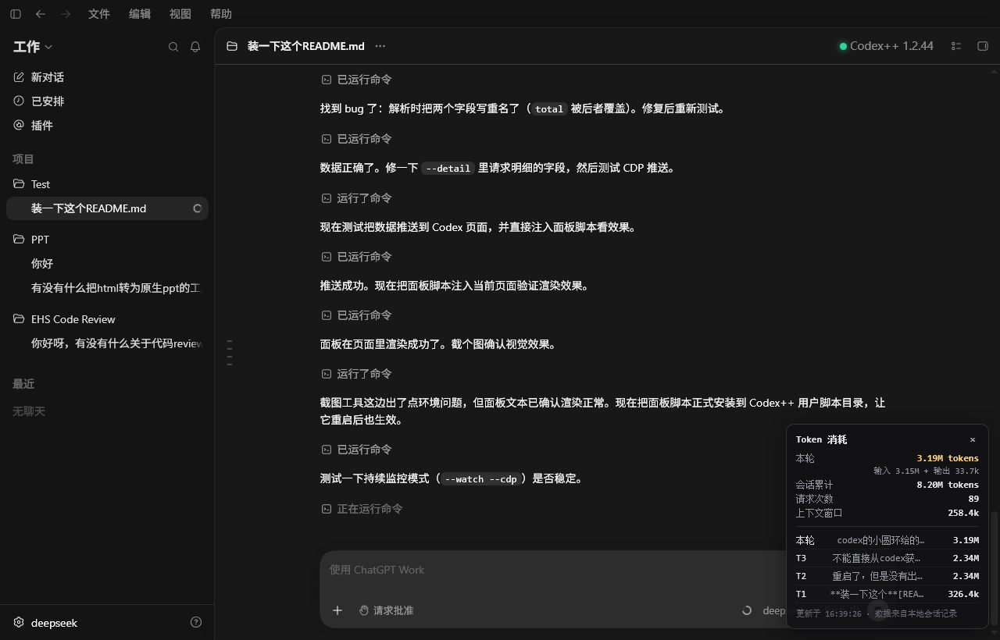
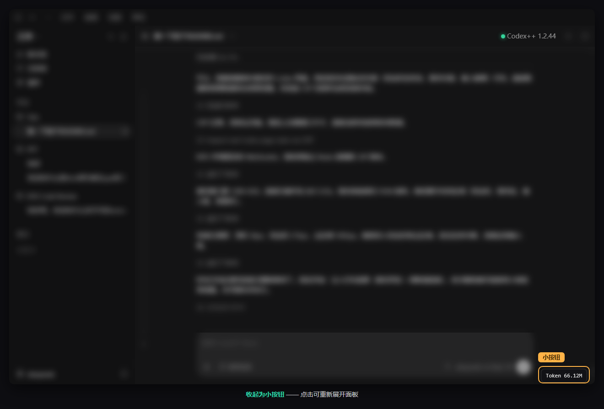

# ccm-token-spend - Token Usage Panel for Codex Desktop

[简体中文](README.md) | [English](README.en.md)

> 🤖 If you are an AI coding assistant (Codex / Claude / Copilot / etc.), read [README.agent.md](README.agent.md) - an installation guide written specifically for agents.

Shows per-thread / per-turn token usage in the bottom-right corner of the Codex / ChatGPT **desktop** app: current-turn usage, session totals, request count, context window (used/total), cached vs. uncached input split, and a recent-turns list. Data refreshes roughly every **1 second**.





## Supported Environments

- **OS: Windows only** (developed and tested on Windows 10 22H2; macOS / Linux are not supported, and the auto-start daemon is Windows-specific).
- **Client: Codex / ChatGPT desktop app** (codex CLI is not supported).
- **Codex++ is required** (it injects the panel script into the page and opens debug port 9229).
- **Node.js >= 22** (node-version), or **bundled Node runtime** (exe-version, no separate Node.js installation needed).

## ⚠️ Prerequisites (Check in Order)

1. **Codex / ChatGPT desktop app only; codex CLI is not supported.**
2. **Codex++ must be installed** (it injects the panel script into the page and pushes data through debug port 9229). Without Codex++, this tool will not work.
3. **Choose one monitor program:**
   - **Node.js (>= 22) installed** -> use `node-version` (script-based, small footprint);
   - **No Node.js** -> use `exe-version` (bundled Node runtime, portable, about 55MB).

```
Decision flow:
Codex desktop? ----no----> Not supported (CLI users stop here)
   |yes
Codex++ installed? ----no----> Install Codex++ first, otherwise not supported
   |yes
Node.js installed? ----yes----> Use node-version
   |no
Use exe-version
```

## Files

- `codex-token-spend-panel.js` - panel script (shared by both versions; copy to the Codex++ user scripts folder)
- `node-version\token-stats.mjs` - Node monitor
- `exe-version\ccm-token-spend.exe` - standalone exe monitor
- `guardian.ps1` / `install-autostart.ps1` / `uninstall-autostart.ps1` - auto-start daemon scripts (Windows only)

## Installation (Shared by Both Versions, Do It Once)

1. Copy `codex-token-spend-panel.js` to the Codex++ user scripts folder:

   ```powershell
   Copy-Item .\codex-token-spend-panel.js "$env:APPDATA\Codex++\user_scripts\" -Force
   ```

2. **Fully quit and restart Codex desktop** so the script gets injected (the panel should appear in the bottom-right corner).

## Running the Monitor (Every Time You Want to Use It)

- **Node version:**
  ```powershell
  cd node-version
  node token-stats.mjs --watch --cdp
  ```
- **exe version:**
  ```powershell
  cd exe-version
  ccm-token-spend.exe --watch --cdp
  ```
- Or simply **double-click** `start-watch.cmd` in the corresponding folder.

Keep this window running.

## Panel Features

- The top summary area (title, current turn, session total, request count, context window) and the bottom "Updated at" bar are **always visible**; only the middle "turn details" area scrolls.
- Panel height auto-fits content: it grows taller when the summary wraps, and it never exceeds the Codex window; after drag-resizing, it snaps back to the content-required height on release.
- The title bar is draggable, and all four corners support resizing; the panel and the mini button remember their positions and sizes separately.
- The `x` button in the top-right corner collapses the panel to a mini button; click the mini button to restore it.
- The conversation history title column stretches automatically with the panel width.

## Auto-Start (Optional): Run the Monitor When Codex Starts

If you do not want to start the monitor manually every time, install the daemon: it stays resident after Windows login, starts the monitor when Codex is running, stops it when Codex exits, and automatically restarts it if the monitor crashes.

1. In PowerShell, from the directory of this tool, run:

   ```powershell
   powershell -ExecutionPolicy Bypass -File .\install-autostart.ps1
   ```

2. It takes effect immediately (no need to restart Codex). To uninstall, run:

   ```powershell
   powershell -ExecutionPolicy Bypass -File .\uninstall-autostart.ps1
   ```

> Install method: registers a Scheduled Task (logon trigger) as the only auto-start mechanism; legacy Startup-folder shortcuts are cleaned up automatically during install. The daemon has a built-in single-instance lock.
>
> Runtime log: `%LOCALAPPDATA%\ccm-token-spend\guardian.log` (records Codex detection / monitor start-stop / failure reasons). When troubleshooting "Waiting for data", check it and `watch.log` first.
>
> Tip: close any manually opened monitor window before installing to avoid duplicate instances.

## Data Notes

- Only reads Codex local session logs (`%USERPROFILE%\.codex\sessions\...\rollout-*.jsonl`); **no API keys involved** - the panel only shows numeric summaries.
- "Session total" = sum of billed tokens across all requests in the thread (including context re-sent in every turn).
- "Context window (used/total)" = used is the context usage of the latest request in the current thread; total is the model context window size.
- "Per turn" = all requests between one user message and the next.
- Input cache split: `Input X (cached Y, uncached Z)`, where uncached = input - cached; old logs without cache fields automatically show `Input X + Output W`.
- New threads (no data yet) show 0 instead of "no data"; switching to a blank new thread does not show the data of the previous thread.
- During Codex startup before the UI finishes loading, it shows 0; after loading completes it automatically shows the data of the current thread (never falls back to the previous thread).

## For Developers: CLI Stats (No Panel Needed)

```powershell
node token-stats.mjs                  # most recent thread
node token-stats.mjs --thread <id>    # specific thread
node token-stats.mjs --detail         # include per-request details
node token-stats.mjs --all            # cumulative usage across all threads
```

## For Developers: Rebuilding the exe (Optional)

```powershell
cd build
npm install          # first time only: installs @yao-pkg/pkg
.\node_modules\.bin\pkg ..\token-stats.mjs --target node22-win-x64 --output ..\release\exe-version\ccm-token-spend.exe
```

## Changelog

See [CHANGELOG.md](CHANGELOG.md) for version history.

## Test Environment

- Windows 10 22H2 (build 19045)
- Codex desktop 26.727.6591.0
- Codex++ 1.2.44
- Node.js v24.14.1
- Currently uses a **third-party API** and was tested with a **single fixed model**; **switching models** (mid-thread) has not been tested.
- Verified: CLI stat output, panel rendering (full turn list, session-total cache split, context window used/total), four-corner resizing, panel/mini-button position memory, always-visible top summary and bottom "Updated at" bar (auto-height at narrow widths without exceeding the window), conversation history title column stretching with width, blank new thread showing 0, and the daemon (starts the monitor when Codex starts, stops it on exit, restarts it on crash).
- macOS / Linux not tested.

## 📝 Environment Test Reports (Contributions Welcome)

After testing, please share your environment to help us gather more compatibility data. Create a new discussion in the **General** category on [GitHub Discussions](https://github.com/THaoKun2022/ccm-token-spend/discussions) and fill in the template (the "测试报告" label is applied automatically):

- **Release version**: e.g. `v1.2-node` (Node) / `v1.2-exe` (bundled Node)
- **OS**: e.g. Windows 10 / Windows 11
- **Codex desktop version**: e.g. `26.727.6591.0`
- **Codex++ version**: e.g. `1.2.44`
- **Ran successfully?**: success / partial issues / failed

## Acknowledgements

The built-in "current thread ID" detection logic references the open-source project [codex-context-used-meter](https://github.com/Minghou-Lei/codex-context-used-meter) (MIT License). It has been fully re-implemented in-house; no external script is required and no extra installation is needed.

